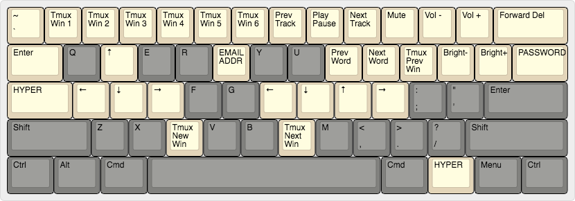

# Keymaps For my Keyboards

## Layouts
### Ergodox [Infinity]
- Default 
  - 
- Layer 1 
  - 

### POK3R
- Default 
  - 
- Layer 1 
  - 

### Macbook Internal Keyboard
- Default 
  - 
- Layer 1 
  - 

## How to Update the Keymaps
### Updating the Images
- Update layouts here: http://www.keyboard-layout-editor.com/

### Updating the Keymap Files 
#### Ergodox (Regular)

- Current keymap location:
  - `keyboard_utilities/ergodox_maps`

1. Update the keymap
    - Online, here: https://www.massdrop.com/configurator/ergodox

1. Download the keymap file(s)
    - Download the `.hex` file from the browser configurator

1. Flash the keymap
    - Load the Teensy application and flash the `.hex` file
    - https://www.pjrc.com/teensy/loader_mac.html

#### Ergodox (Infinity)
- Current keymap location:
  - `keyboard_utilities/ergodox_infinity_maps`

1. Update the keymap
    - With the macOS application, Kiibohd Configurator (v0.4.1)
        - Download here: https://github.com/kiibohd/configurator/releases/tag/v0.4.1
        - (The 1.0 version is borked somehow...)
1. Download the keymap file(s)
   - Download through the Configurator application
   - This will be a zip file named `MDErgo1...`
1. Flash the keymap
    - Locate this zip in Finder
    - Drop this zip into `keyboard_utilities/ergodox_infinity_maps`
    - cd to `keyboard_utilities/ergodox_infinity_maps`
    - Run `./flag_new_bin` with the new zip as the argument
        - For example, `./flash_new_bin.sh MDErgo1-Default-f8a2b7aede1532e55c62f7afe1006af1.zip`
1. OPTIONAL: Backup the keymap as JSON
    - Copy the JSON from the Configurator application, paste it into `layout.json` 

#### Liscense
MIT
