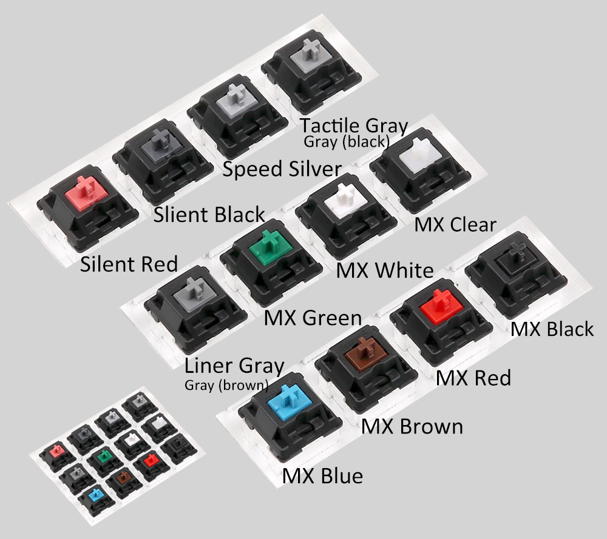
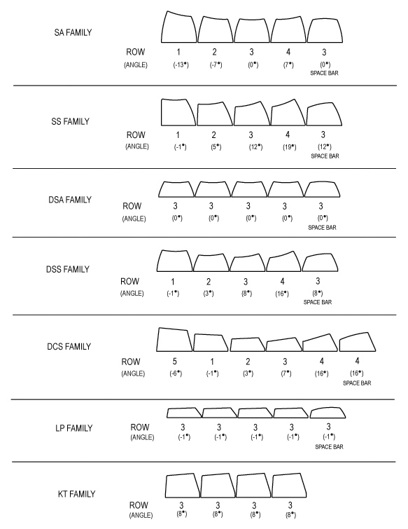
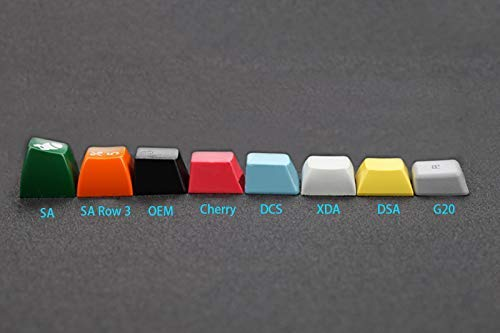

# Resources for Mechanical Keyboards

- I use this to store general information on [mechancal keyboards](https://en.wikipedia.org/wiki/Keyboard_technology#Mechanical-switch_keyboard) as well as resources for my own boards.

## Layouts

### Ergodox [Infinity]

- [Source](layout_jsons/ergodox)
- Default
  - 
- Layer 1
  - 

### POK3R

- [Source](layout_jsons/poker)
- Default
  - 
- Layer 1
  - 

### Macbook Internal Keyboard

- [Source](layout_jsons/macbook)
- Default
  - 
- Layer 1
  - 

### Updating

#### Firmware

- I use [QMK Firmware](https://docs.qmk.fm/#/) to build firmware for my keyboards:
  - [Infinity ErgoDox](https://input.club/devices/infinity-ergodox/)
  - [Ergodox](https://www.ergodox.io/)
- [See my fork of the QMK firmware here](https://github.com/thetomcraig/qmk_firmware)

- Steps to build and flash:
  - `cd` to the qmk submodle [here](qmk_firmware)
  - Update the keymap header file
  - Compfile and flash using the relevant `.sh` file

#### Images

- Update layouts here: http://www.keyboard-layout-editor.com/
- Upload the jsons from [here](layout_jsons)

## General Info

### Switches

| Color | Force | Notes |
| --- | --- | --- |
| Red | 45cN | Smooth, no tactile bump | Soft Linear 45cN - Smooth, no tactile bump |
| Black | 60cN | Firm Linear 60cN - Smooth, no tactile bump |
| Blue | 50cN | Tactile & Clicky 50cN |
| Brown | 45cN | Soft Tactile 45cN - Softer & lighter tactile bump, no click |
| Green | 80cN | Firm tactile & Clicky 80cN |
| Tactile Gray (Black) | 80cN | Tactile 80cN - Firm tactile bump, no click |
| Liner Gray (Brown) | 60cN | Firm Linear 60cN - Tactile bump, no click |
| Clear | 55cN | Tactile 55cN - Tactile bump, no click |
| White| 65cN | Tactile & Clicky 65cN - Tactile and lighter click switch |
| Silent Red | 45cN | Soft Linear 45cN - Smooth & Silent |
| Silent Black | 60cN | Firm Linear 60cN - Smooth & Silent |
| Speed Silver | 45cN | Soft Linear 45cN - Smooth, no tactile bump, 3.4 mm total travel distance only |

### Profiles

## Other Resources

- [A lesson in keycaps](https://www.originativeco.com/pages/a-lesson-in-keycaps)

## Liscense

MIT
