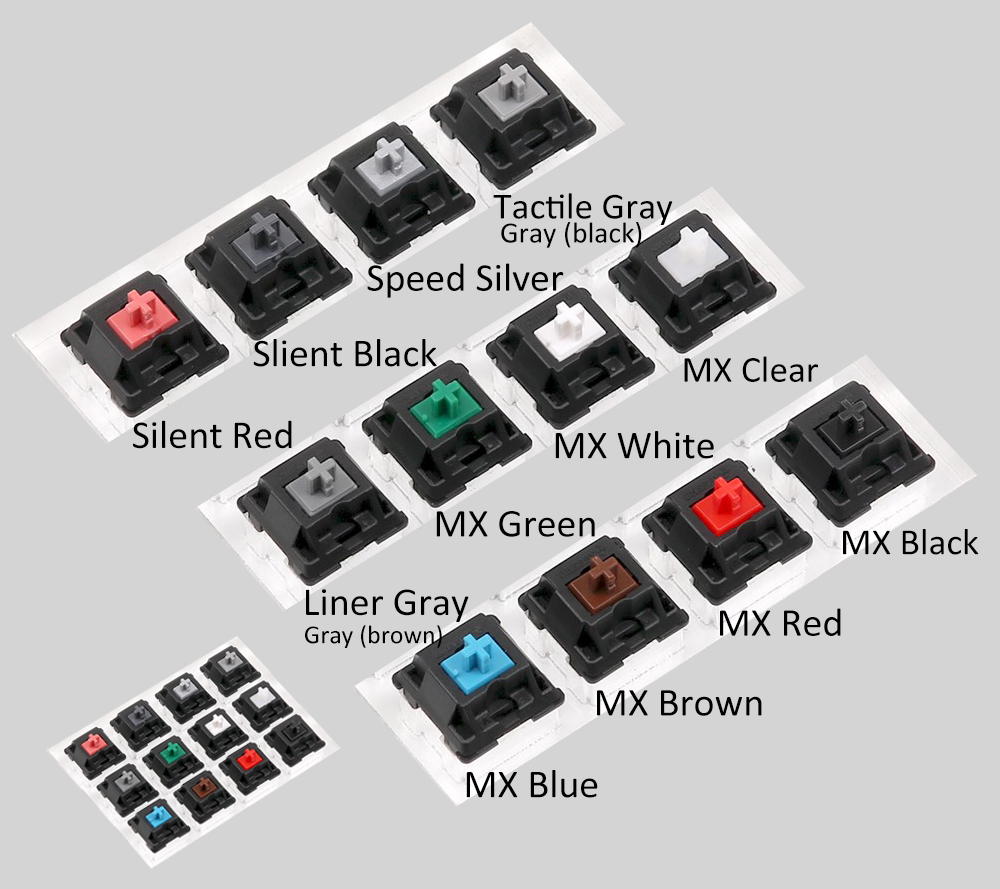

# Switches

| Color | Force | Notes |
| --- | --- | --- |
| Red | 45cN | Smooth, no tactile bump | Soft Linear 45cN - Smooth, no tactile bump |
| Black | 60cN | Firm Linear 60cN - Smooth, no tactile bump |
| Blue | 50cN | Tactile & Clicky 50cN |
| Brown | 45cN | Soft Tactile 45cN - Softer & lighter tactile bump, no click |
| Green | 80cN | Firm tactile & Clicky 80cN |
| Tactile Gray (Black) | 80cN | Tactile 80cN - Firm tactile bump, no click |
| Liner Gray (Brown) | 60cN | Firm Linear 60cN - Tactile bump, no click |
| Clear | 55cN | Tactile 55cN - Tactile bump, no click |
| White| 65cN | Tactile & Clicky 65cN - Tactile and lighter click switch |
| Silent Red | 45cN | Soft Linear 45cN - Smooth & Silent |
| Silent Black | 60cN | Firm Linear 60cN - Smooth & Silent |
| Speed Silver | 45cN | Soft Linear 45cN - Smooth, no tactile bump, 3.4 mm total travel distance only |

* 
